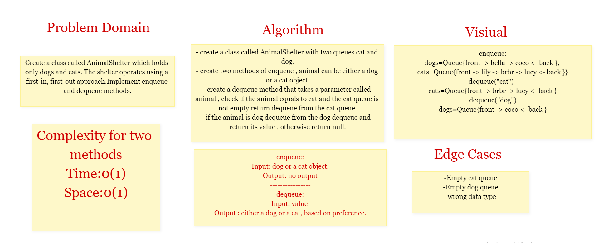

# Stack-and-Queue

Stack and Queue both are the non-primitive data structures. The main differences between stack and queue are that stack uses LIFO (last in first out) method to access and add data elements whereas Queue uses FIFO (First in first out) method to access and add data elements.

## Challenge 10

1. Create the stack class , the class should contain the following methods:
* push 
* pop 
* isEmpty 
* peek

2. Creat the Queue class , the class should contain the following methods:

* enqueue
* dequeue
* isEmpty 
* peek

## Approach & Efficiency

All The methods with complexity O(1)

## API

* push Method : this function accept a value and add it to the stack
* Enqueue Method : this method to accept a value and add a node with the same value to the Queue
* is empty Method : accept a Queue or Stack and return a true if is empty or false if not
* peek : method return the top node value on the stack or the front node value on the Queue
* pop : method delete the top on the stack and return its value
* deQueue : method to delete the front of the Queue and return its value.

## Challenge 12

Create a class called AnimalShelter which holds only dogs and cats. The shelter operates using a first-in, first-out approach.

## Approach & Efficiency

* enqueue :
 time  O(1) 
          space O(1)
* dequeue :
 time  O(1)
          space O(1)
## API
enqueue(animal): adds animal to the shelter. animal can be either a dog or a cat object.
dequeue(pref): returns either a dog or a cat. If pref is not "dog" or "cat" then return null.

