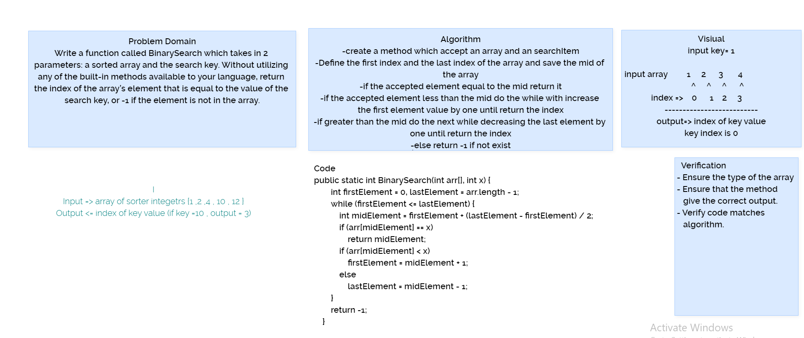

## Binary search

Make a function that responsible to search where is the index of specific element and return the index using the binary search.

## Approach & Efficiency

I used a simple while loop which has 3 different conditions each reassigns a specific variable.

  [Back to table](https://github.com/Marahmusleh/data-structures-and-algorithms/blob/main/java/README.md)