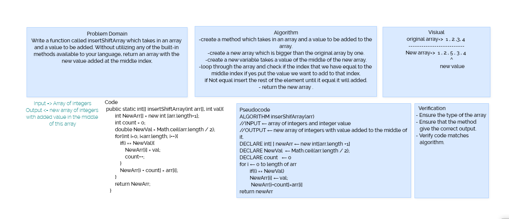

## Insert to Middle of an Array
 I want to have a method that takes an array and a value and return in a new array with the same values as the passed array but with the value in the middle of it.

  [Back to table](https://github.com/Marahmusleh/data-structures-and-algorithms/blob/main/java/README.md)
