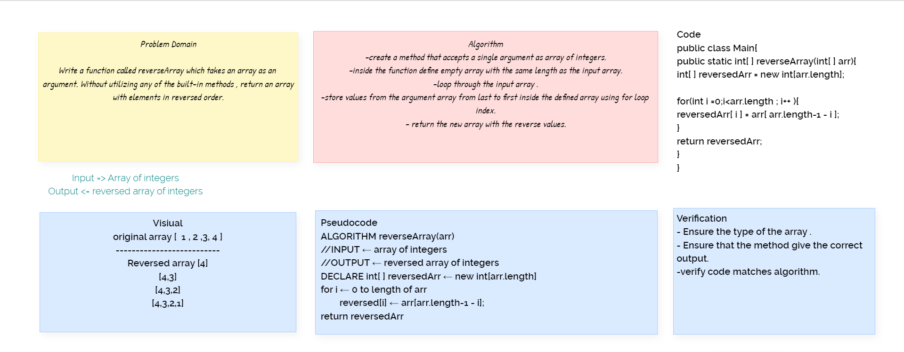

## Reverse an array

* Writing a function called reverseArray which takes an array as an argument. Without utilizing any of the built-in methods available to your language, return an array with elements in reversed order.*

  

  [Back to table](https://github.com/Marahmusleh/data-structures-and-algorithms/blob/main/java/README.md)

## Approach & Efficiency

I used a for loop approach to solve this problem, not only this approach is simple but also it is the best approach for a vanilla array object.
 increase the readability of the code and to improve the maintainability of the code since all three major parts of a loop i.e. initialization, increment / decrement and test condition are written at the same line(in most cases).