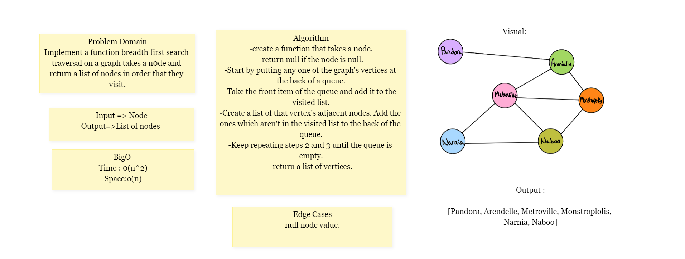
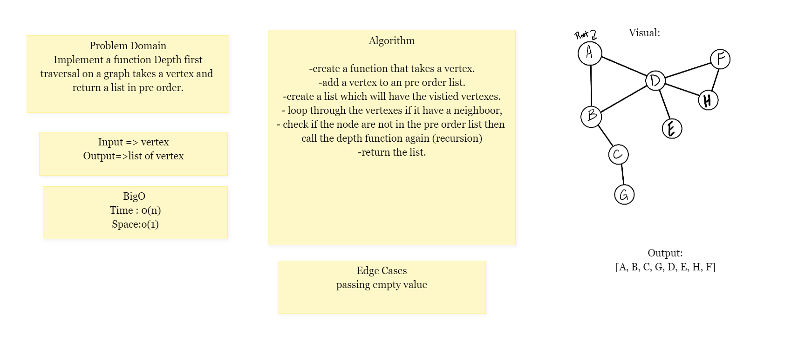

### Challenge 35

Graphs
A graph is a non-linear data structure that can be looked at as a collection of vertices (or nodes)
potentially connected by line segments named edges.

### API
1. add node
* Arguments: value
* Returns: The added node
* Add a node to the graph
2. add edge
* Arguments: 2 nodes to be connected by the edge, weight (optional)
* Returns: nothing
* Adds a new edge between two nodes in the graph
* If specified, assign a weight to the edge
* Both nodes should already be in the Graph
3. get nodes
Arguments: none
Returns all of the nodes in the graph as a collection (set, list, or similar)
4. get neighbors
Arguments: node
Returns a collection of edges connected to the given node
Include the weight of the connection in the returned collection
5. size
Arguments: none
Returns the total number of nodes in the graph

### Approach & Efficiency
* addNode: Time: BigO(1), Space: BigO(1)
* addEdge: Time: BigO(n), Space: BigO(1)
* getNodes(): Time: BigO(1), Space: BigO(1)
* getNeighbors: Time: BigO(n), Space: BigO(n)
* size(): Time: BigO(1), Space: BigO(1)

### challenge 36
* Implement a breadth-first traversal on a graph, by create method that it takes vertex and return a list of vertex in order that they visit.

### Approach & Efficiency
 Time: BigO(n^2)
 Space: BigO(n)

### challenge 37
*Write a function called business trip Determine whether the trip is possible with direct flights, and how much it would cost.

Approach & Efficiency
Time: BigO(n)
Space: BigO(1)

### challenge 38
* Implement a depth-first traversal on a graph, by create method that it takes vertex and return a list in pre order.

### Approach & Efficiency
 Time: BigO(n)
 Space: BigO(1)

