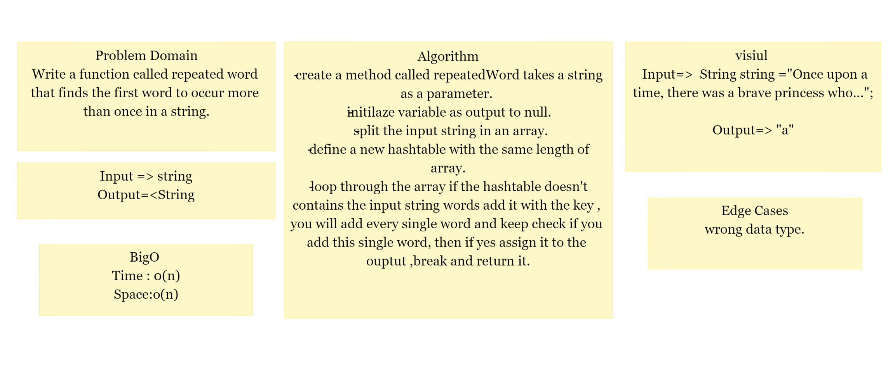
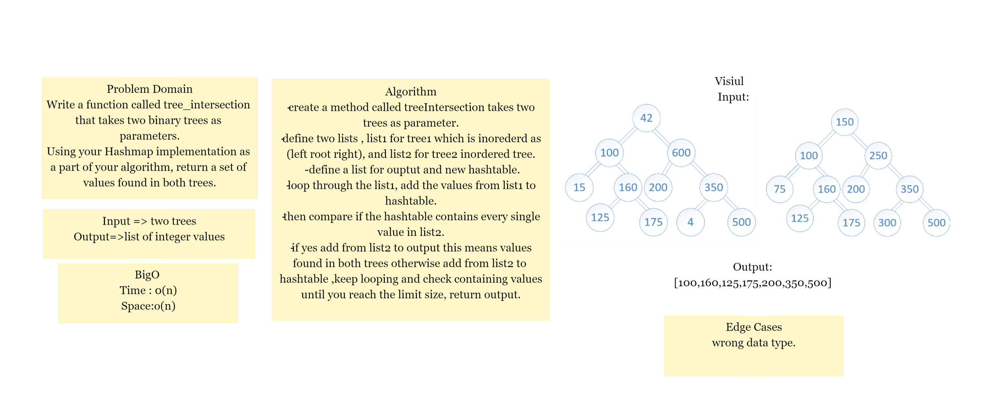
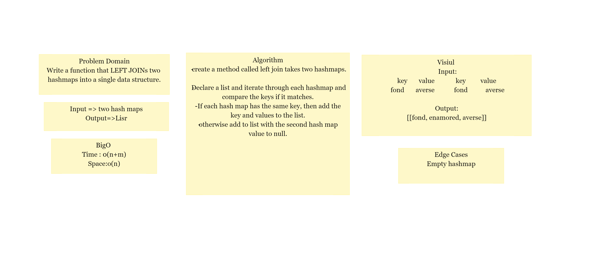

# Hashtables
is a data structure that implements an associative array abstract data type, a structure that can map keys to values, and hash table uses a hash function to compute an index, also called a hash code, into an array of buckets or slots, from which the desired value can be found.

### Challenge 30
Implement a Hashtable Class with the following methods:

* add
Arguments: key, value
Returns: nothing
This method should hash the key, and add the key and value pair to the table, handling collisions as needed.
* get
Arguments: key
Returns: Value associated with that key in the table
* contains
Arguments: key
Returns: Boolean, indicating if the key exists in the table already.
* hash
Arguments: key
Returns: Index in the collection for that key

### Approach & Efficiency
* add() and HashTable():
Time: BigO(n), Space: BigO(n)
* get():
 Time: BigO(n), Space: BigO(1)
* getHash()and contains():
 Time: BigO(1), Space: BigO(1)

### API
add(key, value): hash the key and add the key and the value to the table.
HashTable(size): generate hash by the key and return hash with the key
get(key): return the value for the key.
hash(key): return the index of the key.
contains(key): check if the key exist in the hash table.

### Challenge 31

Write a function called repeated word that finds the first word to occur more than once in a string
* Arguments: string
* Return: string

### Approach & Efficiency
Time : o(n) 
Space:o(n)

### Challenge 32

### find a set of values found in both trees.

### API

* treeTintersection: takes two binary trees as parameters,
Using Hashmap implementation ,return a set of values found in both trees.

### Approach & Efficiency
Time : o(n) 
Space:o(n)

### Challenge 33

Left Join
Implement a simplified LEFT JOIN for 2 Hashmaps.

Approach & Efficiency

Time	Space
O(m+n)	O(n)