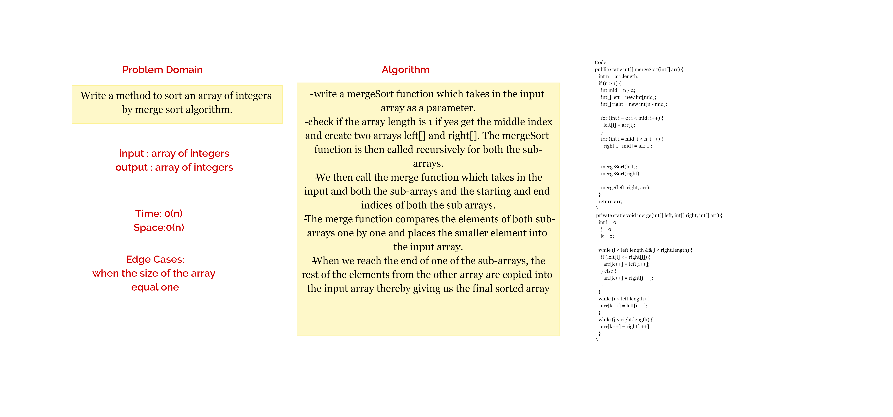

## Challenge 26

### Selection Sort
Selection Sort is a sorting algorithm that traverses the array multiple times as
it slowly builds out the sorting sequence. The traversal keeps track of the
minimum value and places it in the front of the array which should be
incrementally sorted.

### Trace

### Efficency
* Time: O(n^2) The basic operation of this algorithm is comparison. This will happen n * (n-1) number of times…concluding the algorithm to be n squared.
* Space: O(1) No additional space is being created. This array is being sorted in place…keeping the space at constant O(1).

## Challenge 27

Merge sort is a “divide and conquer” algorithm wherein we first divide the problem into subproblems. When the solutions for the subproblems are ready, we combine them together to get the final solution to the problem.

### Trace 
* pass 1: divide the original array into 2 arrays (left and right).
* pass 2: divide left array also to left and right, until the size becomes 1, and the same for the right array.
*pass3: the merge processes come into action and start merging arrays back while sorting.

### Efficency
* Time: O(n)
* Space: O(n)
