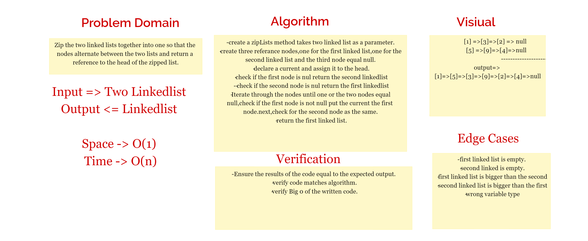

## SinglyLinkedLists

Creating Node class, LinkedList class and instantiate a linked list in the main
Where nodes single connected to each other stated from the head, example: {1} -> {2} -> {3} -> NULL

## Approach & Efficiency

```
while(current != null) {

        result += "{ " + current.getData() + " } -> ";

        current = current.getNext();
    }
```

That will confirm that the next node in the list isn't null

**Space -> o(1)**
**Time -> O(n)**

## Linked List (challenge5)

## API
The linked list should contain the following methods with their tests:

* insert: takes an string value and creates a new node into the linked list holding that value.
* includes: checks if a certain value is in one of the nodes in the linked list.
* toString: returns a String including Approach & Efficiency
  challenge 06:
  append

## Challenge6

## Description of the challenge

Create a Linked List class which has three methods, append, InsertBefore, InsertAfter.

````
append
Time: O(1)
Space: O(1)

insert before and insert after:

Time: O(n)
Space: O(1) the values of the linked list nodes.
````

### API

* append method: Add new nodes to the last in the linked list.
* InserBefore method: have an value exists in the linklist and new value to put it before the existing value.
* InsetAfter method: have an value exists in the linklist and new value to put it after the existing value.


## Challenge7

## Description of the challenge

Create a Linked List class which has three method LinkedListKTH.

## Approach & Efficiency

For LinkedListKTH method: Time => Big O(n), Space => Big O(1)

## API

LinkedListKTH method: method that it take an index of specific node we need to return the node value for this index


## Chellenge 8

* ZipLists method we need to Zip the two linked lists together into one so that the nodes alternate between the two lists and return a reference to the head of the zipped list.



## Approach & Efficiency

For ZipLists method: Time => Big O(n), Space => Big O(1)

## API

zipLists method: method that it take two Linked List o Zip the two linked lists together into one.

## Solution
>{ 1 } -> { 3 } -> { 2 } -> Null
 { 5 } -> { 9 } -> { 4 } -> Null
 { 1 } -> { 5 } -> { 3 } -> { 9 } -> { 2 } -> { 4 } -> Null
