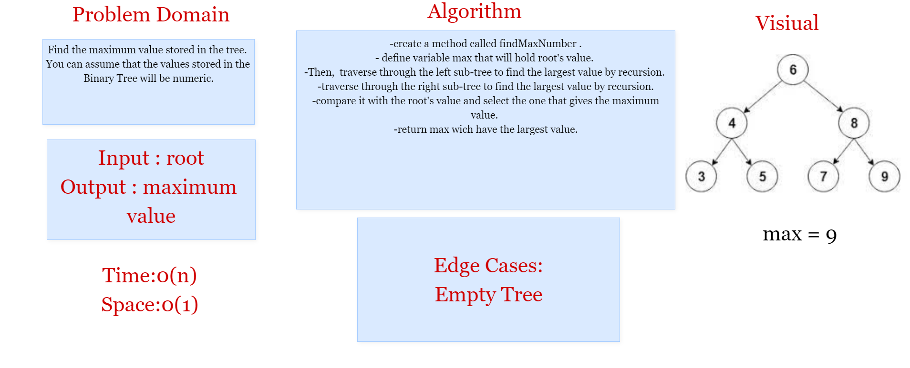
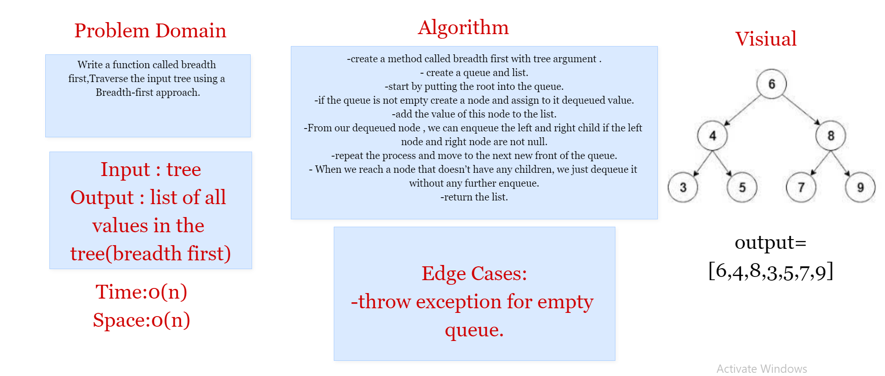
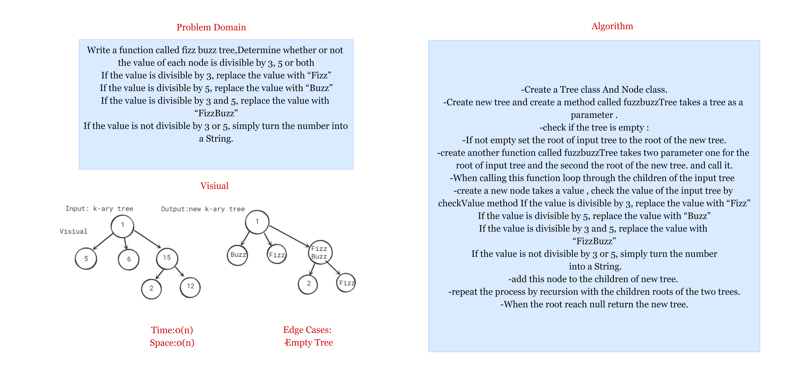

## Challenge 15
Create a Binary Tree class
Define a method for each of the depth first traversals:
* pre order
* in order
* post order
Create a Binary Search Tree class with (add,contains)methods.
### Approach & Efficiency

* Time: O(1)
* Space: O(n)
## API
* add >> Adds a new node with that value in the correct location in the binary search tree.
* contains >> return boolean indicating whether or not the value is in the tree at least once.
* For Binary Class each method changes the order in which we search/print the root:
* Pre-order: root >> left >> right
* In-order: left >> root >> right
* Post-order: left >> right >> root

## Challenge 16
Find the maximum value stored in the tree.

### Approach & Efficiency
the approach that I've used is the recursion function With complexity : time > O(n) , space > O(1)

## Challenge 17

Traverse the input tree using a Breadth-first approach.

### Approach & Efficiency
the approach that I've used is Queue o traverse the width/breadth of the tree With complexity : time > O(n) , space > O(n)

## Challenge 18

Write a function called fizz buzz tree. take arguments: k-ary tree and return: new k-ary tree Create a new tree with the same structure as the original, but the values modified as follows:

If the value is divisible by 3, replace the value with “Fizz”.
If the value is divisible by 5, replace the value with “Buzz”.
If the value is divisible by 3 and 5, replace the value with “FizzBuzz”.
If the value is not divisible by 3 or 5, simply turn the number into a String.
## API
fizzBuzzTree(): a method that accept a tree as input and return new modified tree as mentioned above

### Approach & Efficiency
 time > O(n) , space > O(n)